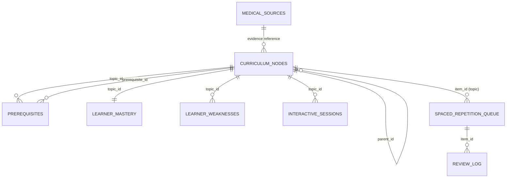

# MedForge V3 Database Schema Documentation

## Overview

The V3 schema extends MedForge from a simple evidence store into a comprehensive medical education platform with:

- **360 ECTS Curriculum Hierarchy** — European medical degree structure
- **Prerequisite Dependency Graph** — Topic dependencies with weights
- **Learner Mastery Tracking** — Mastery scores, confidence, attempts
- **Diagnostic Weaknesses** — Misconceptions, severity, resolution
- **Interactive Study Sessions** — 5 session types with metrics
- **Spaced Repetition (SM-2/FSRS)** — Scheduling parameters + review history
- **Medical Evidence Provenance** — Source tracking with human/animal study flag

### Runtime wiring (MedForge 2.1+)

The learner-facing tables are used by `current/medforge/learner.py`:

- `medforge study <topic>` (and the dashboard STUDY tab) opens an
  `interactive_sessions` row (`Learn`, `completed_at NULL`) for every mission.
- `medforge study-log <topic> <score>` / `mf.log_study_result(...)` completes
  that row in place with the self-score, folds it into `learner_mastery`
  (running mean; confidence = share of attempts ≥ 70/100), and records
  `learner_weaknesses` (re-observation escalates severity, never degrades).
- `medforge mastery` / `mf.learner_snapshot()` aggregates the three tables for
  the dashboard's STUDY tab and the CLI report.
- `build_product` imports the flashcards it generates into
  `spaced_repetition_queue` (`item_type='card'`, `state='new'`, due now). The
  `item_id` is `"<topic-slug>:<sha256(question)[:16]>"`, so rerunning or
  rebuilding a pack only adds new questions. `mf.import_flashcards(topic, csv)`
  does the same on demand, and `medforge import-cards [topic]` schedules every
  saved pack.
- `mf.due_items()` / `medforge due` list cards due now (question, answer and
  source labels are resolved from the pack's `flashcards.csv`; the queue itself
  stores only scheduling state). Cards of weak topics (mastery < 70 or any
  unresolved weakness) sort ahead of the rest.
- `mf.review_card(item_id, grade, scheduler=...)` / `medforge review <item_id>
  <0-5> [sm2|fsrs]` reschedule a card. Two schedulers share one interface:
  `sm2` (default) advances 1 day → 6 days → previous interval × ease with the
  ease floored at 1.30 (the `ease_factor` CHECK); `fsrs` implements FSRS-4.5
  with the published default parameters and fills `stability`/`difficulty`.
  Grades below 3 are lapses in both: repetitions reset, the card enters
  `relearning`, and it returns after `LAPSE_STEP_MINUTES` (10 minutes, the
  schema's `interval_days REAL` supports sub-day steps).
- Every review appends to `review_log` (grade, scheduler, before/after
  interval/ease/state). `mf.review_analytics()` / `medforge due` compute
  30-day retention, day streaks, per-day review counts, and leeches (cards
  with ≥ 3 lapses) from it.
- Lapses of graduated cards record `learner_weaknesses` (concept = card
  question, misconception "Lapsed during flashcard review"); a card that
  graduates back to `review` resolves the matching weakness. The dashboard
  REVIEW tab renders the flashcard session, due list, analytics, and leeches
  via `mf.spaced_repetition_snapshot()`.
- `ensure_v3_tables()` applies `V3_SCHEMA_DDL` idempotently on every call, so a
  legacy V2 database self-heals without an explicit migration.

Topics are stored as slugs (`slugify(topic)`); the `topic_id` columns are
free-form text, so curriculum-node IDs can be adopted later without a schema
change.

---

## Entity Relationship Diagram



---

## Tables

### 1. `curriculum_nodes` — 360 ECTS Hierarchy

| Column | Type | Constraints | Description |
|--------|------|-------------|-------------|
| `id` | TEXT | PRIMARY KEY | Unique identifier (e.g., `Y1`, `Y1S1`, `MED101`, `CVS-MOD`) |
| `parent_id` | TEXT | FK → curriculum_nodes(id) ON DELETE SET NULL | Parent in hierarchy |
| `node_type` | TEXT | CHECK IN ('Year','Semester','Course','Module','Topic','Subtopic','Learning Objective') | Hierarchy level |
| `code` | TEXT | DEFAULT '' | Short code (e.g., `MED101`, `CVS-TOP-01`) |
| `title` | TEXT | NOT NULL | Display title |
| `description` | TEXT | DEFAULT '' | Detailed description |
| `year` | INTEGER | CHECK (1-6) | Academic year (1-6) |
| `semester` | INTEGER | CHECK (1-12) | Semester number (1-12) |
| `ects_weight` | REAL | ≥ 0, DEFAULT 0 | ECTS credits |
| `order_index` | INTEGER | DEFAULT 0 | Sort order within parent |
| `created_at` | TEXT | NOT NULL | ISO timestamp |
| `updated_at` | TEXT | NOT NULL | ISO timestamp |

**Indexes:** `idx_curriculum_parent`, `idx_curriculum_type`, `idx_curriculum_year_sem`

---

### 2. `prerequisites` — Topic Dependency Graph

| Column | Type | Constraints | Description |
|--------|------|-------------|-------------|
| `id` | INTEGER | PRIMARY KEY AUTOINCREMENT | Surrogate key |
| `topic_id` | TEXT | FK → curriculum_nodes(id) ON DELETE CASCADE | Dependent topic |
| `prerequisite_id` | TEXT | FK → curriculum_nodes(id) ON DELETE CASCADE | Required topic |
| `dependency_weight` | REAL | CHECK (0.0-1.0), DEFAULT 1.0 | Strength of dependency |
| `relationship_type` | TEXT | CHECK IN ('strict','recommended','co-requisite'), DEFAULT 'strict' | Dependency type |
| `created_at` | TEXT | NOT NULL | ISO timestamp |

**Unique:** `(topic_id, prerequisite_id)`
**Indexes:** `idx_prereq_topic`, `idx_prereq_prerequisite`

---

### 3. `learner_mastery` — Mastery Tracking

| Column | Type | Constraints | Description |
|--------|------|-------------|-------------|
| `id` | INTEGER | PRIMARY KEY AUTOINCREMENT | Surrogate key |
| `topic_id` | TEXT | UNIQUE, FK → curriculum_nodes(id) | Topic reference |
| `mastery_score` | REAL | CHECK (0-100), DEFAULT 0 | Mastery percentage |
| `confidence_score` | REAL | CHECK (0-100), DEFAULT 0 | Confidence percentage |
| `total_attempts` | INTEGER | ≥ 0, DEFAULT 0 | Total practice attempts |
| `successful_attempts` | INTEGER | ≥ 0, DEFAULT 0 | Successful attempts |
| `last_attempt_at` | TEXT | NULLABLE | Last attempt timestamp |
| `created_at` | TEXT | NOT NULL | ISO timestamp |
| `updated_at` | TEXT | NOT NULL | ISO timestamp |

**Indexes:** `idx_mastery_topic`, `idx_mastery_score`

---

### 4. `learner_weaknesses` — Diagnostic Misconceptions

| Column | Type | Constraints | Description |
|--------|------|-------------|-------------|
| `id` | INTEGER | PRIMARY KEY AUTOINCREMENT | Surrogate key |
| `topic_id` | TEXT | FK → curriculum_nodes(id) | Related topic |
| `concept` | TEXT | NOT NULL | Specific concept |
| `misconception` | TEXT | NOT NULL | Description of misconception |
| `error_count` | INTEGER | ≥ 1, DEFAULT 1 | Times observed |
| `severity` | TEXT | CHECK IN ('low','medium','high','critical'), DEFAULT 'medium' | Severity level |
| `is_resolved` | INTEGER | CHECK (0,1), DEFAULT 0 | Resolution status |
| `resolved_at` | TEXT | NULLABLE | Resolution timestamp |
| `first_observed_at` | TEXT | NOT NULL | First observation |
| `last_observed_at` | TEXT | NOT NULL | Last observation |

**Indexes:** `idx_weakness_topic`, `idx_weakness_status`

---

### 5. `interactive_sessions` — Study Session Log

| Column | Type | Constraints | Description |
|--------|------|-------------|-------------|
| `id` | INTEGER | PRIMARY KEY AUTOINCREMENT | Surrogate key |
| `session_type` | TEXT | CHECK IN ('Learn','Active Recall','Case','Viva','Prerequisite Repair') | Session type |
| `topic_id` | TEXT | FK → curriculum_nodes(id) | Topic studied |
| `score` | REAL | CHECK (0-100), DEFAULT 0 | Session score |
| `duration_seconds` | INTEGER | ≥ 0, DEFAULT 0 | Duration |
| `metrics` | TEXT | DEFAULT '{}' | JSON metrics |
| `notes` | TEXT | DEFAULT '' | Free-form notes |
| `created_at` | TEXT | NOT NULL | ISO timestamp |
| `completed_at` | TEXT | NULLABLE | Completion timestamp |

**Indexes:** `idx_sessions_type`, `idx_sessions_topic`, `idx_sessions_created`

---

### 6. `spaced_repetition_queue` — SM-2/FSRS Scheduling

| Column | Type | Constraints | Description |
|--------|------|-------------|-------------|
| `id` | INTEGER | PRIMARY KEY AUTOINCREMENT | Surrogate key |
| `item_type` | TEXT | CHECK IN ('card','topic','concept'), DEFAULT 'card' | Item type |
| `item_id` | TEXT | NOT NULL | Reference ID |
| `repetition_count` | INTEGER | ≥ 0, DEFAULT 0 | Number of reviews |
| `interval_days` | REAL | ≥ 0, DEFAULT 0 | Current interval |
| `ease_factor` | REAL | ≥ 1.30, DEFAULT 2.50 | SM-2 ease factor |
| `stability` | REAL | ≥ 0, DEFAULT 0 | FSRS stability |
| `difficulty` | REAL | CHECK (0-10), DEFAULT 0 | FSRS difficulty |
| `due_date` | TEXT | NOT NULL | Next review due |
| `last_reviewed_at` | TEXT | NULLABLE | Last review |
| `last_grade` | INTEGER | CHECK (0-5), NULLABLE | Last grade (0-5) |
| `state` | TEXT | CHECK IN ('new','learning','review','relearning'), DEFAULT 'new' | FSRS state |
| `created_at` | TEXT | NOT NULL | ISO timestamp |
| `updated_at` | TEXT | NOT NULL | ISO timestamp |

**Unique:** `(item_type, item_id)`
**Indexes:** `idx_sr_due_date`, `idx_sr_state`, `idx_sr_item`

---

### 6b. `review_log` — Spaced Repetition Review History

Append-only log of every review; the queue keeps only the latest state.

| Column | Type | Constraints | Description |
|--------|------|-------------|-------------|
| `id` | INTEGER | PRIMARY KEY AUTOINCREMENT | Surrogate key |
| `item_type` | TEXT | CHECK IN ('card','topic','concept'), DEFAULT 'card' | Item type |
| `item_id` | TEXT | NOT NULL | Queue reference |
| `grade` | INTEGER | CHECK (0-5) | Grade given |
| `scheduler` | TEXT | DEFAULT 'sm2' | `sm2` or `fsrs` |
| `interval_before` | REAL | ≥ 0 | Interval before review |
| `interval_after` | REAL | ≥ 0 | Interval after review |
| `ease_before` | REAL | ≥ 1.30 | Ease before review |
| `ease_after` | REAL | ≥ 1.30 | Ease after review |
| `state_before` | TEXT | CHECK IN queue states | State before review |
| `state_after` | TEXT | CHECK IN queue states | State after review |
| `reviewed_at` | TEXT | NOT NULL | ISO timestamp |

**Indexes:** `idx_review_log_item`, `idx_review_log_time`

---

### 7. `medical_sources` — Evidence Provenance

| Column | Type | Constraints | Description |
|--------|------|-------------|-------------|
| `id` | TEXT | PRIMARY KEY | Unique identifier |
| `title` | TEXT | NOT NULL | Publication title |
| `authors` | TEXT | DEFAULT '' | Author list |
| `publication_type` | TEXT | CHECK IN ('Guideline','Textbook','Meta-Analysis','Research','Educational') | Type |
| `is_human_study` | INTEGER | CHECK (0,1), DEFAULT 1 | Human vs animal |
| `study_design` | TEXT | DEFAULT '' | Study design |
| `journal_or_publisher` | TEXT | DEFAULT '' | Journal/publisher |
| `publication_year` | INTEGER | NULLABLE | Year |
| `pmid` | TEXT | DEFAULT '' | PubMed ID |
| `doi` | TEXT | DEFAULT '' | DOI |
| `url` | TEXT | DEFAULT '' | URL |
| `evidence_level` | TEXT | DEFAULT '' | Evidence grade |
| `trust_score` | REAL | CHECK (0-1), DEFAULT 0.8 | Trust weight |
| `raw_metadata` | TEXT | DEFAULT '{}' | JSON metadata |
| `created_at` | TEXT | NOT NULL | ISO timestamp |
| `updated_at` | TEXT | NOT NULL | ISO timestamp |

**Indexes:** `idx_sources_type`, `idx_sources_human`, `idx_sources_pmid`, `idx_sources_doi`

---

### 8. `schema_migrations` — Migration History

| Column | Type | Constraints | Description |
|--------|------|-------------|-------------|
| `version` | TEXT | PRIMARY KEY | Schema version |
| `name` | TEXT | NOT NULL | Migration name |
| `applied_at` | TEXT | NOT NULL | Application timestamp |

---

## Migration

Run V3 migration explicitly:

```bash
python -m medforge_core migrate
```

Or programmatically:

```python
from medforge.storage import migrate_database
result = migrate_database()
```

**Features:**
- Non-destructive (preserves V2 tables: `chunks`, `study_sessions`, `weaknesses`)
- Verified SQLite backup via backup API
- Integrity checks before and after
- Idempotent (safe to re-run)
- Rollback support via `rollback_migration()`

---

## Enum Reference

### `NODE_TYPES` (V3)
`('Year', 'Semester', 'Course', 'Module', 'Topic', 'Subtopic', 'Learning Objective')`

### `CURRICULUM_NODE_TYPES` (V4)
`NODE_TYPES + ('Subject', 'Week', 'Seminar')`

V4 (migration `4.0.0`, `core/database/migrate_v4.py`) widens the
`curriculum_nodes.node_type` CHECK with `Subject`, `Week` and `Seminar` so the
canonical curriculum hierarchy (SEMESTER → SUBJECT → WEEK → SEMINAR → TOPIC →
SUBTOPIC → LEARNING OBJECTIVE) is expressible. The rebuild is row-preserving
and self-healing on first curriculum use; it also adds the unique
`idx_curriculum_parent_title` index (parent COALESCEd, so root titles are
covered) and `idx_curriculum_type_order`. See `docs/CURRICULUM.md`.

### V5 textbook enums
`TEXTBOOK_NODE_TYPES` = `('Chapter', 'Section', 'Subsection')` ·
`TEXTBOOK_SOURCE_TYPES` = `('textbook', 'lecture_notes', 'handout',
'guideline', 'paper', 'other')` · `TEXTBOOK_PAGE_STATUS` = `('ok', 'no_text',
'error')` · `TEXTBOOK_OCR_STATUS` = `('not_needed', 'pending', 'unavailable',
'complete')` · `TEXTBOOK_INGEST_STATUS` = `('REGISTERED', 'EXTRACTED',
'PARTIAL', 'FAILED')` · `CURRICULUM_TEXT_LINK_TYPES` = `('primary',
'supporting', 'supplementary')`.

## V5 Textbook Provenance Tables (migration `5.0.0`)

Purely additive; existing tables are untouched. Full model: `docs/TEXTBOOKS.md`.

| Table | Purpose | Key columns |
| --- | --- | --- |
| `textbook_documents` | Book family (stable across editions) | id, title, authors, publisher, edition_label, publication_year, isbn, subject, source_type |
| `textbook_editions` | One row per distinct content hash | id, document_id, **content_hash (unique)**, source_path, page_count, extracted_pages, skipped_pages, chunk_count, ocr_status, ingest_status, ingested_at |
| `textbook_nodes` | Chapter → Section → Subsection tree | id, edition_id, parent_id, node_type, code, title, order_index, start_page, end_page |
| `textbook_pages` | Page-level provenance (one row per PDF page) | id (`edition:pN`), edition_id, page_number, node_id, text_chars, extraction_status, ocr_status |
| `textbook_chunks` | Structural chunks with stable locators | id, edition_id, document_id, node_id, page_number, chunk_index, text, text_hash, word_count, locator |
| `curriculum_text_links` | Curriculum topic ↔ textbook evidence | curriculum_node_id, edition_id, node_id, page_start, page_end, link_type, note; **unique (curriculum, edition, COALESCE(node,''))** |

Defined in `core/database/schema.py` (`V5_SCHEMA_DDL`); applied by
`core/database/migrate_v5.py::ensure_textbook_v5()` (idempotent, self-healing,
optional verified backup at `backups/medforge_pre_v5_backup.db`).

### V6 evidence-graph enums
`CLAIM_TYPES` = `('fact', 'definition', 'mechanism', 'association', 'causation',
'clinical', 'epidemiology', 'question', 'instruction', 'non_factual')` ·
`CLAIM_VERIFICATION_STATUS` = `('PENDING', 'SUPPORTED', 'PARTIALLY_SUPPORTED',
'UNSUPPORTED', 'CONTRADICTED', 'INSUFFICIENT_EVIDENCE', 'NOT_FACTUAL',
'HUMAN_REVIEWED')` · `CLAIM_REVIEW_STATUS` = `('auto', 'needs_review',
'human_reviewed', 'rejected')` · `EVIDENCE_TYPES` = `('textbook', 'course_pdf',
'pubmed', 'web', 'guideline', 'other')` · `CLAIM_EVIDENCE_RELATIONSHIPS` =
`('supports', 'partially_supports', 'contradicts', 'insufficient', 'related')` ·
`VERIFICATION_RESULTS` = `('SUPPORTED', 'PARTIALLY_SUPPORTED', 'UNSUPPORTED',
'CONTRADICTED', 'INSUFFICIENT_EVIDENCE')`.

## V6 Evidence Graph Tables (migration `6.0.0`)

| Table | Purpose | Key fields |
|---|---|---|
| `claims` | First-class extracted claims (content-addressed) | claim_id (sha1(normalized)[:24] PK), claim_text, normalized_text (UNIQUE), claim_type, topic, curriculum_node_id FK, source_labels, source_file, generation_run, verification_status, verification_confidence (0–1), review_status, created_at, updated_at |
| `evidence` | Retrieved source chunks with exact provenance | evidence_id (sha1(chunk\|excerpt_hash)[:24] PK), source_id, chunk_id, evidence_type, document_id, edition_id FK, textbook_node_id FK, chapter_title, section_title, page_number (≥1 or NULL), locator, url, quality (0–1), excerpt, excerpt_hash |
| `claim_evidence` | One deduplicated edge per (claim, evidence) | claim_id FK CASCADE, evidence_id FK CASCADE, relationship, support_confidence, verification_method, notes; **UNIQUE(claim_id, evidence_id)** |
| `verification_runs` | Append-only verification history | verification_id AUTOINCREMENT, claim_id FK CASCADE, evidence_id FK SET NULL, method, result CHECK, confidence, notes, verifier, verifier_version, created_at |

Defined in `core/database/schema.py` (`V6_SCHEMA_DDL`); applied by
`core/database/migrate_v6.py::ensure_evidence_v6()` (idempotent, self-healing,
runs V5 → V4 first so foreign keys always resolve, optional verified backup at
`backups/medforge_pre_v6_backup.db`). Rollback: drop the four new tables — no
existing table is altered. Evidence excerpts are internal verification data and
are never written into distributable artifacts. See `docs/EVIDENCE.md`.

### V7 learner-model enums
`LEARNING_ATTEMPT_ITEM_TYPES` = `('session', 'card', 'question', 'concept',
'topic', 'manual')` · `LEARNING_ATTEMPT_SOURCES` = `('session', 'review',
'manual', 'backfill')` · `LEARNER_WEAKNESS_ORIGINS` = `('manual', 'review',
'learner_model')`.

## V7 Recency-Weighted Learner Model Tables (migration `7.0.0`)

Purely additive: two new tables plus ten guarded `ALTER TABLE ADD COLUMN`
additions to `learner_weaknesses` (no rebuild, no row rewrite). Full model and
math: `docs/LEARNER_MODEL.md`. Audit/execution record: `docs/P6_MATRIX.md`.

| Table | Purpose | Key columns |
| --- | --- | --- |
| `learning_attempts` | Append-only performance events | attempt_id (PK), session_id FK→interactive_sessions SET NULL, curriculum_node_id FK→curriculum_nodes SET NULL, mastery_key, item_type, item_id, presented_at, answered_at, score (0–1), correct, learner_confidence, response_time_seconds, source, content_version, created_at |
| `learner_model_state` | Materialized estimate per `mastery_key` (PK) | curriculum_node_id FK, model_version, half_life_days, mastery_score, weighted_evidence, evidence_count, recent_performance, historical_performance, consistency, uncertainty, confidence_estimate, confidence_calibration, last_attempt_at, last_success_at, last_failure_at, created_at, mastery_updated_at |

`learner_weaknesses` additions: `curriculum_node_id`, `origin` (default
`'manual'`), `weakness_score`, `failure_count`, `recent_failure_rate`,
`prerequisite_impact`, `review_priority`, `low_confidence` (default `0`),
`last_failure_at`, `recovered_at`.

Defined in `core/database/schema.py` (`V7_SCHEMA_DDL`, `V7_WEAKNESS_COLUMNS`);
applied by `core/database/migrate_v7.py::ensure_learner_model_v7()` (idempotent,
self-healing, runs V6 → V5 → V4 first so the session/curriculum foreign keys
resolve, optional verified backup at `backups/medforge_pre_v7_backup.db`).
Rollback: drop the two new tables and leave the additive weakness columns (no
existing data is touched).

### V8 tutor enums
`TUTOR_SESSION_MODES` = `('explain', 'socratic', 'drill', 'correct', 'case',
'review', 'prerequisite_repair')` · `TUTOR_STAGES` = `('TEACH', 'ASK',
'WAITING_FOR_ANSWER', 'EVALUATE', 'EXPLAIN', 'ADAPT', 'COMPLETE')` ·
`TUTOR_SESSION_STATUSES` = `('active', 'waiting', 'blocked', 'completed',
'aborted')` · `TUTOR_QUESTION_TYPES` = `('mcq', 'short_answer', 'recall',
'clinical_reasoning')` · `TUTOR_CORRECTNESS` = `('correct', 'partial',
'incorrect', 'ungraded')` · `TUTOR_ERROR_TYPES` = `('none', 'minor',
'conceptual', 'unknown')` · `TUTOR_GRADING_STATUSES` = `('graded',
'insufficient_evidence', 'retryable', 'ungraded')`. `LEARNER_WEAKNESS_ORIGINS`
gains `'tutor'` (tutor-detected misconceptions keep the P6 weakness model).

## V8 Interactive Tutor Tables (migration `8.0.0`)

Purely additive: three new tables plus indexes (no rebuild, no row rewrite, no
altered column). Session lifecycle, adaptation table, evidence policy and
failure/recovery behaviour: `docs/TUTOR.md`. Audit + execution record:
`docs/P7_MATRIX.md`.

| Table | Purpose | Key columns |
| --- | --- | --- |
| `tutor_sessions` | One persistent teaching session (restart-surviving) | tutor_session_id (PK), topic, mastery_key, curriculum_node_id FK→curriculum_nodes SET NULL, session_objective, mode, stage, status, target_source, target_reason, goal, target_interactions, interaction_count, question_number, correct/partial/incorrect_count, difficulty (1–5), consecutive_failures/successes, concept, current_question_id, current_explanation, pending_answer, pending_confidence, verification_status, evidence_refs, concepts_covered, prerequisites_visited, mastery_at_start, confidence_at_start, summary, model_error, model_calls, review_recorded, tutor_version, started_at, last_activity_at, completed_at, created_at, updated_at |
| `tutor_questions` | Content-addressed question items (P8 reuses these) | item_id (PK, sha1[:16]), tutor_session_id FK, curriculum_node_id FK, topic, mastery_key, concept, question_type, difficulty, prompt, expected_answer, rubric (evidence key points + locator), options, correct_option, evidence_refs, verification_status, question_version, created_at |
| `tutor_turns` | Append-only transcript, one row per teaching/answer/explain/adapt/summary turn | turn_id (PK), tutor_session_id FK CASCADE, turn_number (UNIQUE per session), kind, stage, mode, concept, question_id, question_type, difficulty, prompt, expected_answer, rubric, learner_answer, learner_confidence, score, correctness, error_type, explanation, missing_key_points, incorrect_points, evidence_refs, verification_status, grading_status, grading_source, injection_suspected, attempt_id (P6 learning event), misconception_id, model_used, created_at |

Defined in `core/database/schema.py` (`V8_SCHEMA_DDL`); applied by
`core/database/migrate_v8.py::ensure_tutor_v8()` (idempotent, self-healing,
runs V7 → V6 → V5 → V4 first so the curriculum foreign keys resolve, optional
verified backup at `backups/medforge_pre_v8_backup.db`). Rollback: drop the
three new tables (no existing data is touched).

### V9 assessment enums
`ASSESSMENT_ITEM_TYPES` = `('MCQ_SINGLE', 'MCQ_MULTI', 'TRUE_FALSE',
'SHORT_ANSWER', 'CLINICAL_REASONING', 'RECALL')` · `ASSESSMENT_ITEM_STATUSES`
= `('DRAFT', 'VALIDATION', 'REVIEW_REQUIRED', 'APPROVED', 'ACTIVE', 'RETIRED',
'REJECTED')` · `ASSESSMENT_MODES` = `('PRACTICE', 'EXAM', 'REVIEW')` ·
`ASSESSMENT_SESSION_STATUSES` = `('created', 'active', 'submitted',
'completed', 'expired', 'abandoned')` · `ASSESSMENT_SCOPE_TYPES` = `('topic',
'seminar', 'week', 'subject', 'custom')` · `ASSESSMENT_BLUEPRINT_STATUSES` =
`('DRAFT', 'ACTIVE', 'RETIRED')` · attempt correctness reuses
`TUTOR_CORRECTNESS` and grading status reuses `TUTOR_GRADING_STATUSES`.

## V9 Assessment Tables (migration `9.0.0`)

Purely additive: six new tables plus indexes (no rebuild, no row rewrite, no
altered column). Item lifecycle, versioning, evidence gate, blueprints,
selection, scoring, timing, statistics and remediation: `docs/ASSESSMENT.md`.
Audit + execution record: `docs/P8_MATRIX.md`.

| Table | Purpose | Key columns |
| --- | --- | --- |
| `assessment_items` | Item identity + lifecycle (bank inventory) | item_id (PK), item_type CHECK, status CHECK, current_version, topic, mastery_key, concept, curriculum_node_id FK→curriculum_nodes SET NULL, author, source_kind, generation_mode, item_model_version, quality_flags, retired_at, created_at, updated_at |
| `assessment_item_versions` | Immutable item content per version; `UNIQUE(item_id, item_version)` | item_id FK CASCADE, item_version, stem, difficulty_target (1–5), choices, correct_choices, rubric, correct_answer, explanation, scoring_policy, evidence_requirement, evidence_state, evidence_refs, claim_refs, content_hash, validation_report, duplicate_of, item_model_version, review_note, author, created_at |
| `assessment_blueprints` | Assessment definitions (scope + distributions) | blueprint_id (PK), blueprint_version, title, scope_type CHECK, scope_node_id FK, scope_node_ids, item_count (1–500), type_distribution, difficulty_distribution, topic_distribution, prerequisite_coverage, time_limit_minutes, pass_threshold, status CHECK, validation_report, seed, created_at, updated_at |
| `assessment_sessions` | Persistent assessment sessions, separate from `tutor_sessions` | assessment_id (PK), learner_key, blueprint_id FK SET NULL, blueprint_version, title, mode CHECK, scope_type, scope_node_id, status CHECK, item_order, item_count, current_index, time_limit_minutes, started_at, expires_at, submitted_at, completed_at, elapsed_seconds, raw_score, max_score, percentage, pass_threshold, passed, grading_pending, summary, remediation, model_calls, review_logged, content_version, seed, created_at, updated_at |
| `assessment_attempts` | One row per presented question; `UNIQUE(assessment_id, question_order)`; persists the presented item snapshot | attempt_id (PK AUTOINCREMENT), assessment_id FK CASCADE, item_id, item_version, question_order, stem, item_type, mastery_key, topic, difficulty, choices, correct_choices, rubric, correct_answer, scoring_policy, evidence_refs, evidence_state, presented_at, answered_at, learner_answer, correctness, score, max_score, confidence, response_time_seconds, grading_status, grading_source, grader_version, error_type, explanation, key_points_present, missing_key_points, incorrect_points, grading_history, grading_attempts, flagged, flag_reason, injection_suspected, learning_attempt_id (P6 event), created_at, updated_at |
| `assessment_item_quality` | Persisted per-version statistics snapshots | id (PK AUTOINCREMENT), item_id, item_version, sample_size, metrics, flags, computed_at |

Defined in `core/database/schema.py` (`V9_SCHEMA_DDL`); applied by
`core/database/migrate_v9.py::ensure_assessment_v9()` (idempotent, self-healing,
runs V8 → V7 → V6 → V5 → V4 first so the curriculum foreign keys resolve,
optional verified backup at `backups/medforge_pre_v9_backup.db`). Rollback:
drop the six new tables (no existing data is touched).

### V10 study-intelligence enums
`STUDY_PLAN_STATUSES` = `('ACTIVE', 'COMPLETED', 'RETIRED')` ·
`STUDY_MISSION_STATUSES` = `('created', 'active', 'completed', 'abandoned')` ·
`STUDY_ACTION_TYPES` = `('NEW_TEACHING', 'REVIEW', 'DRILL', 'PREREQUISITE_REPAIR',
'TUTOR', 'ASSESS', 'REMEDIATION', 'RECALL', 'SPACED_REVIEW')` ·
`STUDY_ACTION_STATUSES` = `('pending', 'in_progress', 'done', 'skipped',
'failed')` · `STUDY_TOPIC_STATES` = `('NOT_STARTED', 'IN_PROGRESS', 'STUDIED',
'ASSESSING', 'MASTERED_ESTIMATE', 'REVIEW_DUE')` · `CONTENT_ARTIFACT_TYPES` =
`('study_guide', 'cheat_sheet', 'flashcards', 'quiz', 'mind_map', 'script')` ·
`CONTENT_ARTIFACT_STATUSES` = `('DRAFT', 'VALIDATING', 'READY',
'NEEDS_REVIEW', 'BLOCKED')` · `ADAPTATION_PROFILES` = `('weak', 'developing',
'strong', 'underconfident', 'overconfident')`.

## V10 Study Intelligence Tables (migration `10.0.0`)

Purely additive: five new tables plus indexes (no rebuild, no row rewrite, no
altered column). Orchestration design: `docs/STUDY_INTELLIGENCE.md`; canonical
content + rendering: `docs/PRODUCT_FACTORY.md`. Audit + execution record:
`docs/P9_MATRIX.md`.

| Table | Purpose | Key columns |
| --- | --- | --- |
| `study_plans` | Persistent, reproducible plans; re-planning appends a new version | plan_id (PK), learner_key, title, scope_type, scope_node_id, scope_titles, objective, target_date, daily_minutes CHECK 5–480, priorities, actions, gaps, status CHECK, planner_version, config, seed, plan_version CHECK ≥ 1, supersedes_plan_id, created_at, updated_at |
| `study_missions` | One mission per attempt, bound to real P7/P8 sessions, with explicit completion | mission_id (PK), plan_id FK→study_plans SET NULL, learner_key, topic, mastery_key, curriculum_node_id FK→curriculum_nodes SET NULL, objective, action_type CHECK, adaptation_profile CHECK, steps, estimated_minutes CHECK ≥ 1, evidence_refs, expected_outcome, completion_criteria, status CHECK, tutor_session_id, assessment_id, current_step CHECK ≥ 0, results, started_at, completed_at, study_version, created_at, updated_at |
| `study_actions` | Append-only auditable action log (the study record) | action_id (PK AUTOINCREMENT), mission_id FK→study_missions SET NULL, plan_id, topic, mastery_key, action_type CHECK, status CHECK, reason, engine_ref, outcome, occurred_at, created_at |
| `content_items` | Canonical evidence-grounded content, one row per (topic, sources, config, prompt, model) | content_id (PK), topic, mastery_key, curriculum_node_id FK SET NULL, sources_digest, config_digest, prompt_version, model, content, evidence_refs, generation_mode (`model` \| `deterministic_fallback`), content_version, study_version, created_at |
| `content_artifacts` | Rendered artifacts with version, checksum, status and validation | artifact_id (PK), content_id FK→content_items CASCADE, artifact_type CHECK, artifact_version CHECK ≥ 1, adaptation_profile CHECK, path, checksum, status CHECK, validation, render_mode, created_at |

Indexes: `idx_study_plans_status`, `idx_study_missions_status`,
`idx_study_missions_topic`, `idx_study_actions_topic`, `idx_study_actions_mission`,
`idx_content_items_topic`, `idx_content_artifacts_content`,
`idx_content_artifacts_topic_type`.

Defined in `core/database/schema.py` (`V10_SCHEMA_DDL`); applied by
`core/database/migrate_v10.py::ensure_study_v10()` (idempotent, self-healing,
runs `ensure_assessment_v9` first so the curriculum foreign keys resolve,
verifies `integrity_check` + `foreign_key_check`, optional verified backup at
`backups/medforge_pre_v10_backup.db`). Rollback: drop the five new tables (no
existing data is touched).

## V11 Publication Workflow Tables (migration `11.0.0`)

P10 content lifecycle. Additive: three new tables + seven nullable columns on
`content_artifacts` (`publication_status` default `'UNREVIEWED'`, `approved_at`,
`approved_by`, `published_at`, `published_path`, `retired_at`,
`retired_reason`).

- `review_queue` — findings from approval gates or reviewers:
  review_id, content_id (FK CASCADE), artifact_id, issue_type, severity,
  detected_reason, detected_by, review_status, reviewer, reviewed_at,
  resolution, created_at, updated_at.
- `review_history` — append-only audit trail: history_id, review_id,
  action, reviewer, note, created_at.
- `approval_records` — one batch per gate run: approval_id, content_id
  (FK CASCADE), artifact_id, requested_status, gates (JSON), passed,
  created_at.

Enums: `PUBLICATION_STATUSES` (`UNREVIEWED/APPROVED/PUBLISHED/RETIRED/BLOCKED`),
`REVIEW_SEVERITIES`, `REVIEW_STATUSES`, `REVIEW_ISSUE_TYPES`, `EXPORT_MODES`
(`private/distributable`).

Indexes: `idx_review_queue_content`, `idx_review_queue_status`,
`idx_review_history_review`, `idx_approval_records_content`.

Defined in `core/database/schema.py` (`V11_SCHEMA_DDL`); applied by
`core/database/migrate_v11.py::ensure_publication_v11()` (idempotent, runs
`ensure_study_v10` first, verified backup at
`backups/medforge_pre_v11_backup.db`). Rollback: drop the three new tables.
See `docs/PUBLICATION.md`.

### `PREREQUISITE_TYPES`
`('strict', 'recommended', 'co-requisite')`

### `WEAKNESS_SEVERITY`
`('low', 'medium', 'high', 'critical')`

### `SESSION_TYPES`
`('Learn', 'Active Recall', 'Case', 'Viva', 'Prerequisite Repair')`

### `SPACED_REPETITION_STATES`
`('new', 'learning', 'review', 'relearning')`

### `SPACED_REPETITION_ITEM_TYPES`
`('card', 'topic', 'concept')`

### `MEDICAL_PUBLICATION_TYPES`
`('Guideline', 'Textbook', 'Meta-Analysis', 'Research', 'Educational')`

### Migration 12.0.0 (P11 — Video Production)

Adds the `video_renders` table:

```sql
CREATE TABLE video_renders (
    video_id            TEXT PRIMARY KEY,
    content_id          TEXT NOT NULL REFERENCES content_items(content_id) ON DELETE CASCADE,
    aspect              TEXT NOT NULL CHECK (aspect IN ('16:9','9:16','1:1')),
    status              TEXT NOT NULL CHECK (status IN ('RENDERING','READY','FAILED')),
    path                TEXT,
    duration_s          REAL,
    width               INTEGER,
    height              INTEGER,
    size_bytes          INTEGER,
    checksum            TEXT,
    srt_path            TEXT,
    vtt_path            TEXT,
    manifest_path       TEXT,
    storyboard_checksum TEXT,
    scene_count         INTEGER,
    error               TEXT,
    created_at          TEXT NOT NULL DEFAULT (datetime('now')),
    UNIQUE (content_id, aspect)
);
CREATE INDEX idx_video_renders_content ON video_renders(content_id);
CREATE INDEX idx_video_renders_status  ON video_renders(status);
```

Applied by `core/database/migrate_v12.py::ensure_video_v12()` (chains
V9→V10→V11→V12, verified backup at
`backups/medforge_pre_v12_backup.db`). Rollback: drop `video_renders`.
See `docs/VIDEO.md`.

### Migration 13.0.0 (P12 — Provider Abstraction + Model Router)

Adds the `model_runs` audit table:

```sql
CREATE TABLE model_runs (
    run_id         TEXT PRIMARY KEY,
    task           TEXT NOT NULL CHECK(task IN ('teaching','grading','generation','assessment','reasoning','general','embedding')),
    model          TEXT NOT NULL,
    provider       TEXT NOT NULL CHECK(provider IN ('ollama','lmstudio','openai','mock')),
    provider_display TEXT NOT NULL DEFAULT '',
    content_id     TEXT NULL REFERENCES content_items(content_id) ON DELETE SET NULL,
    tokens_in      INTEGER NOT NULL DEFAULT 0 CHECK(tokens_in >= 0),
    tokens_out     INTEGER NOT NULL DEFAULT 0 CHECK(tokens_out >= 0),
    latency_ms     INTEGER NOT NULL DEFAULT 0 CHECK(latency_ms >= 0),
    success        INTEGER NOT NULL DEFAULT 0 CHECK(success IN (0, 1)),
    error          TEXT NULL,
    model_size_gb  REAL NULL,
    model_context  INTEGER NULL,
    created_at     TEXT NOT NULL
);
CREATE INDEX idx_model_runs_task ON model_runs(task, created_at);
CREATE INDEX idx_model_runs_content ON model_runs(content_id);
CREATE INDEX idx_model_runs_provider ON model_runs(provider, model);
```

Applied by `core/database/migrate_v13.py::ensure_provider_v13()` (chains
V9→V10→V11→V12→V13, verified backup at
`backups/medforge_pre_v13_backup_*.db`). Rollback: drop `model_runs`.
See `docs/PROVIDERS.md` (to be created).